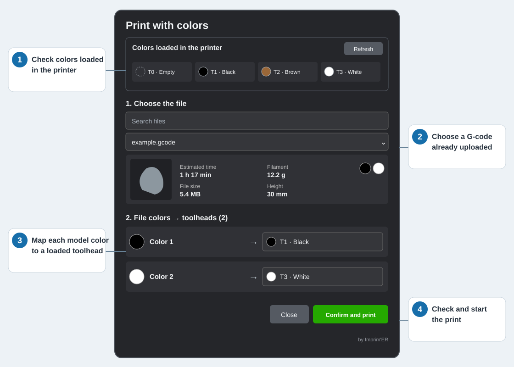

# Choose colors before printing from Fluidd

English · [Français](README.md)

The goal of this project is to **choose colors when starting a print from Fluidd**. On a WonderMaker ZR Ultra S, the bookmark lets you assign each color in an OrcaSlicer file to the toolhead holding the filament you want. It then starts the G-code already uploaded to Fluidd without changing the file.

## Before you start

- Use Fluidd in a desktop browser and upload the OrcaSlicer G-code to the printer first.
- Check which filaments are loaded and which colors are declared on the printer screen.
- The Klipper configuration must support redirecting T0–T3 commands to physical toolheads. The WonderMaker 1.1.12 configuration examined here does. **The bookmark checks this before printing** and blocks an incompatible printer.

On a compatible printer, installing the bookmark requires **no printer configuration change**, SSH access, or browser extension.

## Install the bookmark once

1. Open [the installer page](dist/Installer_favori_couleurs_Fluidd.html) on GitHub, click **Download raw file** (the download icon), then open the downloaded HTML file.
2. Show your browser’s bookmarks bar and drag the green **Print with colors** button onto it.
3. Open Fluidd and click that bookmark. Replace any older bookmark from this project with this version.

If dragging does not work, open **Drag and drop not working?** on the installer page. It lets you copy the address into a bookmark created manually.

## Use the bookmark for each print

1. **Choose the file.** Select an OrcaSlicer G-code already uploaded to Fluidd.
2. **Check “On the printer”.** This shows T0–T3, their screen-declared colors, and empty toolheads. Click **Refresh** after changing a filament or its color on the printer screen.
3. **Map the colors.** The swatch on the left of each row comes from the **file**. The swatch and T0–T3 number in the choice on the right come from the **printer**. Choose the toolhead with the spool you actually want. In the diagram, “Color 1” is assigned to T1; if that spool were in T2, you would choose T2.
4. **Check and start.** Click **Confirm and print**. Click **Close** to leave without printing.

Printer swatches approximate the colors **declared on its screen**: no sensor measures the filament’s actual color. An empty toolhead or uncertain sensor state blocks printing. If several file colors use the same toolhead, they print with the same filament and a warning appears.

## Compatibility and limitations

Tests succeeded on **one printer only**, the project printer, including reassigned toolheads, using **Firefox, Chrome, and Edge**. Safari, phones, and tablets have not been tested.

**Experimental project.** Operation on another printer or firmware version is not guaranteed. Check the filaments and toolhead assignments before every print, and monitor the start of the print. Use this project at your own risk; the author accepts no responsibility for failed prints, wasted filament, or printer damage.

For internals, Klipper prerequisites, and the other repository files, see the [technical documentation](docs/DEVELOPMENT.en.md).

Code and documentation are available under the [MIT license](LICENSE).
