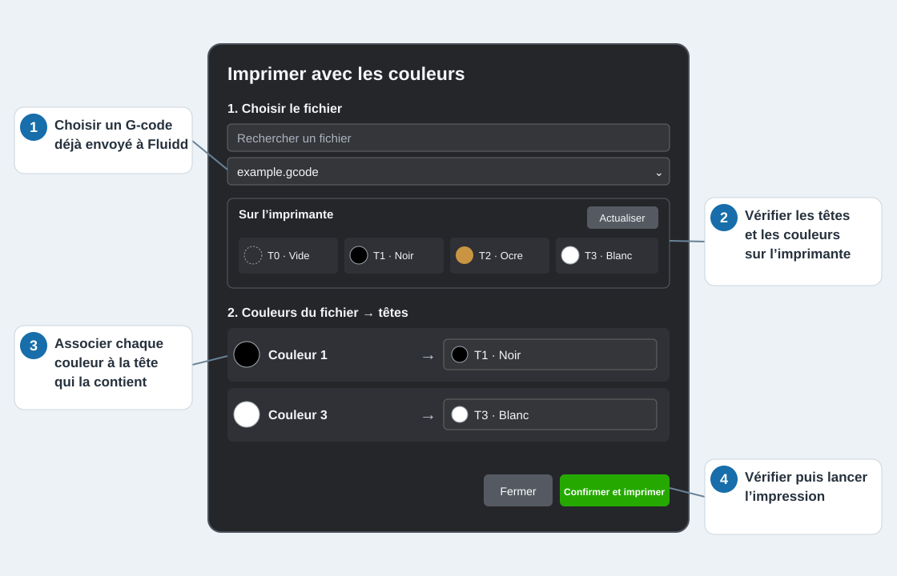

# Choisir les couleurs avant d’imprimer depuis Fluidd

Français · [English](README.en.md)

Le but de ce projet est de **choisir les couleurs au moment de lancer une impression depuis Fluidd**. Sur une WonderMaker ZR Ultra S, le favori permet d’associer chaque couleur du fichier OrcaSlicer à la tête qui contient le filament souhaité. Il lance ensuite le G-code déjà présent dans Fluidd, sans le modifier.

## Avant de commencer

- Utiliser Fluidd sur un navigateur d’ordinateur et avoir déjà envoyé le G-code OrcaSlicer à l’imprimante.
- Vérifier sur l’écran de l’imprimante quels filaments sont chargés et quelles couleurs y sont déclarées.
- La configuration Klipper doit permettre de rediriger les commandes T0–T3 vers les têtes physiques. C’est le cas de la configuration WonderMaker 1.1.12 étudiée ici. **Le favori vérifie ce point avant d’imprimer** et bloque le lancement si la machine n’est pas compatible.

Sur une machine compatible, l’installation du favori ne demande **aucune modification de la configuration de l’imprimante**, aucun accès SSH et aucune extension de navigateur.

## Installer le favori une fois

1. Ouvrir [la page d’installation](dist/Installer_favori_couleurs_Fluidd.html) dans GitHub, cliquer sur **Download raw file** (icône de téléchargement), puis ouvrir le fichier HTML téléchargé.
2. Afficher la barre des favoris du navigateur et y faire glisser le bouton vert **Imprimer avec les couleurs**.
3. Ouvrir Fluidd et cliquer sur ce favori. Remplacer tout ancien favori du projet par cette version.

Si le glisser-déposer ne fonctionne pas, ouvrir **Le glisser-déposer ne fonctionne pas ?** sur la page d’installation : elle permet de copier l’adresse à coller dans un favori créé manuellement.

## Utiliser le favori à chaque impression

1. **Choisir le fichier.** Sélectionner un G-code OrcaSlicer déjà envoyé à Fluidd. Un petit aperçu du modèle apparaît si le fichier en contient un.
2. **Regarder « Sur l’imprimante ».** Cette zone montre les têtes T0–T3, la couleur déclarée sur l’écran et les têtes vides. Cliquer sur **Actualiser** après un changement de filament ou de couleur sur l’écran.
3. **Associer les couleurs.** À gauche de chaque ligne, la pastille vient du **fichier**. Dans le choix à droite, la pastille et le numéro T0–T3 viennent de **l’imprimante**. Choisir la tête qui contient réellement la bobine voulue. Sur le schéma, « Couleur 1 » est associée à T1 ; si cette bobine était en T2, il faudrait choisir T2.
4. **Vérifier et lancer.** Cliquer sur **Confirmer et imprimer**. Cliquer sur **Fermer** pour quitter sans imprimer.

Les pastilles de l’imprimante reproduisent approximativement les couleurs **déclarées sur son écran** : aucun capteur ne mesure la couleur réelle du filament. Une tête vide ou un état de capteur incertain bloque le lancement. Si plusieurs couleurs du fichier utilisent la même tête, elles sortiront avec le même filament et un avertissement s’affiche.

## Compatibilité et limites

Les essais ont réussi sur **une seule imprimante**, celle du projet, y compris avec une réaffectation des têtes, depuis **Firefox, Chrome et Edge**. Safari, les téléphones et les tablettes n’ont pas été testés.

**Projet expérimental.** Le fonctionnement sur une autre imprimante ou une autre version du firmware n’est pas garanti. Vérifiez les filaments et la correspondance des têtes avant chaque impression et surveillez le début de l’impression. Vous utilisez ce projet à vos risques ; son auteur décline toute responsabilité en cas d’impression ratée, de perte de filament ou de dommage à l’imprimante.

Pour comprendre le fonctionnement interne, les prérequis Klipper et les autres fichiers du dépôt, voir la [documentation technique](docs/DEVELOPPEMENT.md).

Code et documentation sous [licence MIT](LICENSE).
